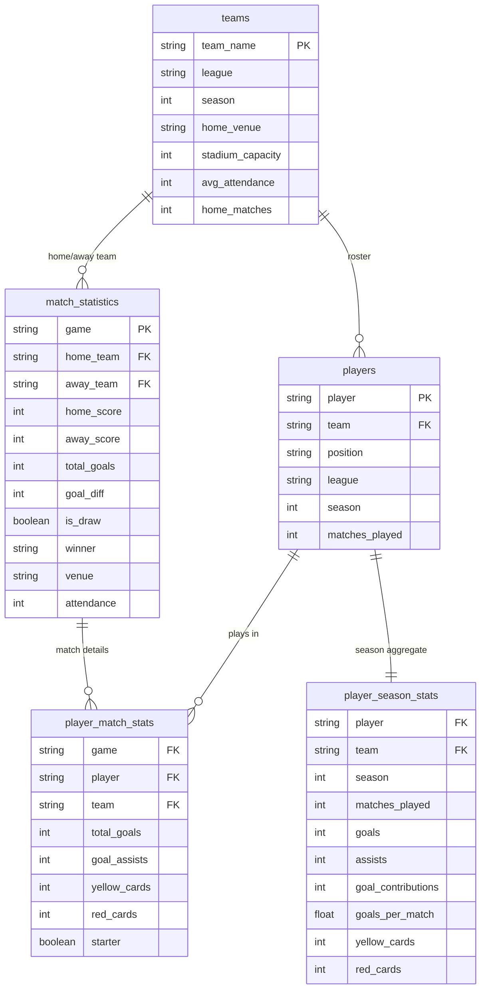

# Futebol Estatisticas Data Pipeline

Pipeline de dados de futebol de ponta a ponta, projetado com praticas modernas de Data Engineering. O pipeline realiza a extracao automatizada de dados, o armazenamento em camadas seguindo a arquitetura Medallion (Data Lakehouse) e a persistencia final em tabelas Iceberg. A orquestracao e inteiramente gerenciada pelo **Apache Airflow**.

## Arquitetura de Dados (Medallion Architecture)

```text
   [Source: ESPN API via soccerdata]
                │
                ▼
  ┌──────────────────────────────────┐
  │ Airflow DAG:                     │
  │ brasileirao_lakehouse_pipeline   │
  └──────────────────────────────────┘
        │                        │
        ▼                        ▼
  ┌──────────┐            ┌────────────┐
  │ Task 1   │            │ Task 2     │
  │ docker   │            │ soccerdata │
  │ start    │            │ + boto3    │
  │ spark    │            │ → MinIO    │
  └──────────┘            └────────────┘
                                │
                    ┌───────────┴───────────┐
                    ▼           ▼           ▼
              schedule.json matchsheet  lineup.json
                    │       .json         │
                    └───────────┬──────────┘
                                ▼
                    ┌────────────────────┐
                    │ Task 3: Spark      │
                    │ nbconvert --execute│
                    │ (Bronze → Silver)  │
                    └────────────────────┘
                                │
                    ┌───────────┼───────────┐
                    ▼           ▼           ▼
              Silver       Silver       Silver
              Dimensions   Facts        Gold
                                │
                                ▼
                    ┌────────────────────┐
                    │ Task 4: docker     │
                    │ stop spark         │
                    │ (free RAM)         │
                    └────────────────────┘
```

### Camadas de Dados

| Camada | Armazenamento | Conteudo |
|---|---|---|
| **Bronze (Raw)** | MinIO (`datalake-raw`) | JSONs brutos do ESPN (schedule, matchsheet, lineup) |
| **Silver (Cleansed)** | Iceberg (`lake.analytics`) | Tabelas dimensionais e fatos normalizados |
| **Gold (Curated)** | Iceberg (`lake.analytics`) | Agregacoes prontas para analytics e ML |

## Modelo de Dados (Iceberg Tables)



## Stack Tecnologico

| Categoria | Tecnologia | Proposito |
|---|---|---|
| **Orquestracao** | Apache Airflow 3.x | Agendamento, dependencias, retries |
| **Extracao** | Python, soccerdata, boto3 | ESPN API, upload MinIO |
| **Processamento** | Apache Spark + Iceberg | Transformacoes Silver/Gold |
| **Object Storage** | MinIO (S3-compatible) | Bronze layer (datalake-raw) |
| **Data Warehouse** | Apache Iceberg | Silver/Gold tables ACID |
| **Containers** | Docker, Docker Compose | Spark e MinIO infra |

## Estrutura de Diretorios

```text
football_statistics/
├── dags/                           # Airflow DAGs
│   ├── lib/                        # Business logic (extraction helpers)
│   ├── brasileirao_lakehouse_pipeline.py  # Full pipeline DAG
│   ├── brasileirao_teams_to_pg.py         # Extraction + PG queue
│   └── consume_brasileirao_queue_to_pg.py # PG ingestion
├── infra/
│   ├── spark/
│   │   ├── notebooks/              # Jupyter/PySpark notebooks
│   │   │   ├── spark_silver_processing.ipynb  # Silver/Gold processing
│   │   │   └── lakehouse_end_to_end.ipynb     # Interactive dev notebook
│   │   ├── conf/spark-defaults.conf  # Iceberg + MinIO config
│   │   └── docker-compose.yaml       # Spark container
│   └── minio/
│       └── docker-compose.yaml       # MinIO + bucket init
├── tests/                          # Unit tests
├── Makefile                        # infra-up / infra-down / logs
└── requirements.txt
```

## Configuracao do Ambiente

1. **Python Virtual Environment**:
   ```bash
   python -m venv venv
   source venv/bin/activate
   pip install -r requirements.txt
   ```

2. **Infraestrutura (MinIO + Spark)**:
   ```bash
   make infra-up
   ```

3. **Symlink do Airflow**:
   ```bash
   ln -sfn $(pwd)/dags $AIRFLOW_HOME/dags
   ```

## Testes

```bash
pytest tests/ -v
```

## Roadmap

- [x] Extracao confiavel com `soccerdata` (ESPN: schedule, matchsheet, lineup)
- [x] Pipeline incremental (Queue-based com `.jsonl`)
- [x] Ingestao Idempotente no PostgreSQL (Dynamic Upsert)
- [x] Bronze layer em MinIO (S3-compatible)
- [x] Silver: Tabelas dimensionais (`teams`, `players`) e fatos (`match_statistics`, `player_match_stats`)
- [x] Gold: Agregacoes de temporada (`player_season_stats`)
- [x] Orquestracao Airflow com lifecycle management do Spark
- [ ] Modelagem Dimensional avancada (Star Schema completo)
- [ ] Data Quality (dbt / Great Expectations)
- [ ] ML: Modelos Preditivos (PyTorch)
