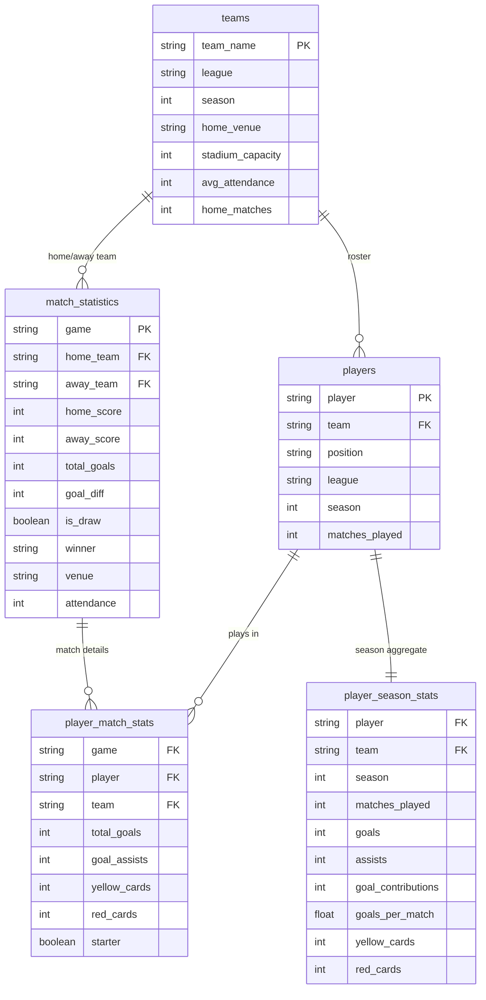

# Futebol Estatisticas Data Pipeline

Pipeline de dados de futebol de ponta a ponta, projetado com praticas modernas de Data Engineering. O pipeline realiza a extracao automatizada de dados, o armazenamento em camadas seguindo a arquitetura Medallion (Data Lakehouse) e a persistencia final em tabelas Iceberg. A orquestracao e inteiramente gerenciada pelo **Apache Airflow**.

## Arquitetura de Dados (Medallion Architecture)

   [Source: ESPN API via soccerdata]
                │
                ▼
  ┌─────────────────────────────────────────────┐
  │ Bronze DAGs (×4, @hourly, 1 per league)     │
  │ bronze_extraction__<league>                 │
  └─────────────────────────────────────────────┘
                │
                ▼
      Dataset("minio://datalake-raw/espn/bronze")
                │
                ▼
  ┌─────────────────────────────────────────────┐
  │ silver_processing DAG                       │
  │ docker run --rm football-spark silver_job   │ (ephemeral Spark container)
  └─────────────────────────────────────────────┘
                │
                ▼
      Dataset("iceberg://lake/analytics/silver")
                │
                ▼
  ┌─────────────────────────────────────────────┐
  │ gold_processing DAG                         │
  │ docker run --rm football-spark gold_job     │ (ephemeral Spark container)
  └─────────────────────────────────────────────┘
                │
                ▼
      Dataset("iceberg://lake/analytics/gold")

### Camadas de Dados

| Camada | Armazenamento | Conteudo |
|---|---|---|
| **Bronze (Raw)** | MinIO (`datalake-raw`) | JSONs brutos do ESPN (schedule, matchsheet, lineup) |
| **Silver (Cleansed)** | Iceberg (`lake.analytics`) | Tabelas dimensionais e fatos normalizados |
| **Gold (Curated)** | Iceberg (`lake.analytics`) | Agregacoes prontas para analytics e ML |

## Modelo de Dados (Iceberg Tables)


```mermaid
erDiagram
    teams {
        string team_name PK
        string league
        int season
        string home_venue
        int stadium_capacity
        int avg_attendance
        int home_matches
    }

    players {
        string player PK
        string team FK
        string position
        string league
        int season
        int matches_played
    }

    match_statistics {
        string game PK
        string home_team FK
        string away_team FK
        int home_score
        int away_score
        int total_goals
        int goal_diff
        boolean is_draw
        string winner
        string venue
        int attendance
    }

    player_match_stats {
        string game FK
        string player FK
        string team FK
        int total_goals
        int goal_assists
        int yellow_cards
        int red_cards
        boolean starter
    }

    player_season_stats {
        string player FK
        string team FK
        int season
        int matches_played
        int goals
        int assists
        int goal_contributions
        float goals_per_match
        int yellow_cards
        int red_cards
    }

    teams ||--o{ match_statistics : "home/away team"
    teams ||--o{ players : "roster"
    players ||--o{ player_match_stats : "plays in"
    match_statistics ||--o{ player_match_stats : "match details"
    players ||--|| player_season_stats : "season aggregate"
```

## Stack Tecnologico

| Categoria | Tecnologia | Proposito |
|---|---|---|
| **Orquestracao** | Apache Airflow 3.x (nativo, systemd) | DAGs, data-aware scheduling, retries, pools |
| **Extracao** | Python, soccerdata, boto3 | ESPN API → DataFrames → MinIO |
| **Processamento** | Apache Spark 3.5 (ephemeral `docker run`) | Transformacoes Silver/Gold; imagem custom `football-spark` com jars baked |
| **Object Storage** | MinIO (S3-compatible) | Bronze layer (`datalake-raw`) + artefatos de qualidade |
| **Table format** | Apache Iceberg 1.6.1 | Tabelas Silver/Gold: ACID, schema evolution, time travel, hidden partitioning |
| **Control plane / Serving** | PostgreSQL | Estado da pipeline (`pipeline_season_control`) + resultados de qualidade |
| **Qualidade de dados** | Great Expectations 1.3 + measured gates | Suites declarativas + gates em-job que abortam antes do write |
| **Lineage** | OpenLineage (Airflow provider) | Eventos run/job/dataset (namespace `football_pipeline`) |
| **Metricas e dashboards** | Prometheus + Grafana | Infra + control-plane dashboard |
| **Telemetria** | OpenTelemetry Collector | Metricas e traces do Airflow (OTLP) |
| **Containers** | Docker, Docker Compose | MinIO, Spark (jobs + Jupyter), observability stack |
| **CI / qualidade** | GitHub Actions + ruff + pytest + pre-commit | Lint + testes unitarios |

> **Multi-liga:** o Bronze é uma *factory* que registra um DAG por liga
> (`bronze_extraction__BRA-Brasileirao`, `…__ITA-Serie_A`, `…__ENG-Premier_League`,
> `…__FRA-Ligue_1`). O avanço de cada season é coordenado pela tabela
> `pipeline_season_control` (`pending → bronze_done → silver_done → complete`),
> permitindo retry incremental a partir do stage que falhou.

## Estrutura de Diretorios

```text
football_statistics/
├── dags/                                  # Airflow DAGs
│   ├── lib/                               # Lógica de negócio testável
│   │   ├── airflow_common.py              # get_pg_conn, SPARK_POOL, notifiers, otel_span
│   │   ├── extraction_helpers.py          # soccerdata/ESPN → DataFrames → MinIO (Bronze)
│   │   ├── league_config.py               # Registro de ligas + mapeamentos ESPN
│   │   ├── minio_config.py                # Credenciais MinIO (env; sem segredos no código)
│   │   ├── season_helpers.py              # Control plane (claim atômico + transições)
│   │   └── quality_helpers.py             # Registro de quality checks no Postgres
│   ├── brasileirao_bronze_extraction.py   # Factory: 1 DAG Bronze por liga (@hourly)
│   ├── spark_stage_dag.py                 # Factory: silver_processing + gold_processing (ephemeral Spark)
│   ├── iceberg_maintenance.py             # @weekly: rewrite_data_files + expire_snapshots
│   └── pipeline_season_refresh.py         # @weekly: re-queue da season ao vivo
├── spark_jobs/                            # Spark jobs executados dentro do container football-spark
│   ├── silver_job.py                      # Bronze → Silver (Iceberg + GE + measured gates)
│   ├── gold_job.py                        # Silver → Gold (Iceberg + quality gate)
│   └── ge_suites.py                       # Great Expectations suites (ephemeral Data Context)
├── infra/
│   ├── airflow/                           # systemd units + env (instalação nativa)
│   ├── minio/docker-compose.yaml          # MinIO + init de buckets
│   ├── observability/                     # OTel Collector + Prometheus + Grafana + exporters
│   ├── postgres/migrations/               # SQL idempotente (control plane + quality)
│   └── spark/
│       ├── Dockerfile                     # Imagem football-spark (jars Iceberg/S3A + GE baked)
│       ├── conf/spark-defaults.conf       # Iceberg + MinIO (S3A via env creds)
│       ├── notebooks/                     # Notebooks interativos (exploração; não usados na pipeline)
│       └── docker-compose.yaml            # container jupyter-spark (exploração interativa)
├── tests/                                 # Testes unitários (mock psycopg2)
├── Makefile                               # infra-up/down, obs-up/down, airflow-*, setup-pools
├── requirements.txt / requirements-dev.txt / requirements.lock.txt
└── PROJECT_REPORT.md                       # Relatório completo da plataforma
```

## Configuracao do Ambiente

1. **Python Virtual Environment**:
   ```bash
   python -m venv venv && source venv/bin/activate
   pip install -r requirements.txt        # runtime
   pip install -r requirements-dev.txt     # + testes/lint (ruff, pytest)
   ```

2. **Infraestrutura (MinIO + Spark)**:
   ```bash
   make infra-up
   ```

3. **Symlink do Airflow + migrations + pool**:
   ```bash
   ln -sfn $(pwd)/dags $AIRFLOW_HOME/dags
   # aplicar as migrations (idempotentes) do control plane:
   psql -d <db> -f infra/postgres/migrations/001_pipeline_season_control.sql
   psql -d <db> -f infra/postgres/migrations/002_pipeline_quality_checks.sql
   psql -d <db> -f infra/postgres/migrations/003_seed_seasons.sql
   make airflow-setup-pools   # pool size-1 que serializa os jobs Silver/Gold
   ```

4. **Imagem Spark customizada** (necessária para Silver/Gold):
   ```bash
   docker build -t football-spark:latest infra/spark
   ```

5. **Observability stack** (opcional, mas recomendado):
   ```bash
   make obs-up   # Prometheus :9090 · Grafana :3000 (admin/admin)
   ```

> As credenciais do MinIO são lidas do ambiente (ver `.env.example` e
> `infra/airflow/airflow.env`) — não há segredos no código.

## Testes

```bash
pytest tests/ -v        # testes unitários (sem infra; mock psycopg2)
ruff check dags/ tests/ # lint (também roda no CI)
```

## Roadmap

- [x] Extracao confiavel com `soccerdata` (ESPN: schedule, matchsheet, lineup, events)
- [x] Multi-liga (BRA/ITA/ENG/FRA) via DAG factory + control plane (`pipeline_season_control`)
- [x] Bronze layer em MinIO (S3-compatible), `game_map` via object store
- [x] Silver: dims (`teams`, `players`) e fatos (`match_statistics`, `player_match_stats`, `match_events`)
- [x] Gold: Agregacoes de temporada (`player_season_stats`)
- [x] Quality gates no Silver (measured gates + Great Expectations) e Gold; resultados em `pipeline_quality_checks`
- [x] Orquestracao Airflow (data-aware datasets) com jobs Spark efemeros (`football-spark` image)
- [x] Surrogate keys (`athlete_id` ESPN) nas dimensoes `players` e Gold
- [x] Observabilidade: OpenTelemetry → Prometheus/Grafana; Spark History Server; OpenLineage
- [x] Manutencao Iceberg automatica (`iceberg_maintenance` DAG semanal)
- [x] CI/CD: GitHub Actions + ruff + pytest + pre-commit
- [ ] SCD-2 / full star schema
- [ ] OpenLineage → Marquez UI (atualmente file transport)
- [ ] GE Data Docs → MinIO
- [ ] ML: Modelos Preditivos (PyTorch)
