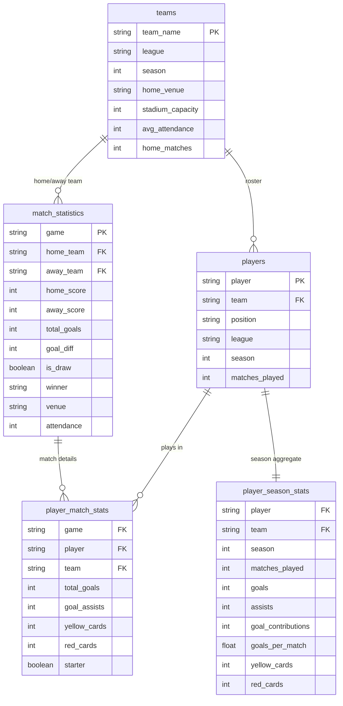

# Futebol Estatisticas Data Pipeline

Pipeline de dados de futebol de ponta a ponta, projetado com praticas modernas de Data Engineering. O pipeline realiza a extracao automatizada de dados, o armazenamento em camadas seguindo a arquitetura Medallion (Data Lakehouse) e a persistencia final em tabelas Iceberg. A orquestracao e inteiramente gerenciada pelo **Apache Airflow**.

## Arquitetura de Dados (Medallion Architecture)

   [Source: ESPN API via soccerdata]
                │
                ▼
  ┌──────────────────────────────────┐
  │ Airflow DAG 1:                   │
  │ brasileirao_bronze_extraction    │
  └──────────────────────────────────┘
                │
                ▼
      Dataset("minio://.../bronze")
                │
                ▼
  ┌──────────────────────────────────┐
  │ Airflow DAG 2:                   │
  │ brasileirao_silver_processing    │ (Starts/Stops Spark)
  └──────────────────────────────────┘
                │
                ▼
      Dataset("iceberg://.../silver")
                │
                ▼
  ┌──────────────────────────────────┐
  │ Airflow DAG 3:                   │
  │ brasileirao_gold_processing      │ (Starts/Stops Spark)
  └──────────────────────────────────┘
                │
                ▼
      Dataset("iceberg://.../gold")

### Camadas de Dados

| Camada | Armazenamento | Conteudo |
|---|---|---|
| **Bronze (Raw)** | MinIO (`datalake-raw`) | JSONs brutos do ESPN (schedule, matchsheet, lineup) |
| **Silver (Cleansed)** | Iceberg (`lake.analytics`) | Tabelas dimensionais e fatos normalizados |
| **Gold (Curated)** | Iceberg (`lake.analytics`) | Agregacoes prontas para analytics e ML |

## Modelo de Dados (Iceberg Tables)


```mermaid
erDiagram
    teams {
        string team_name PK
        string league
        int season
        string home_venue
        int stadium_capacity
        int avg_attendance
        int home_matches
    }

    players {
        string player PK
        string team FK
        string position
        string league
        int season
        int matches_played
    }

    match_statistics {
        string game PK
        string home_team FK
        string away_team FK
        int home_score
        int away_score
        int total_goals
        int goal_diff
        boolean is_draw
        string winner
        string venue
        int attendance
    }

    player_match_stats {
        string game FK
        string player FK
        string team FK
        int total_goals
        int goal_assists
        int yellow_cards
        int red_cards
        boolean starter
    }

    player_season_stats {
        string player FK
        string team FK
        int season
        int matches_played
        int goals
        int assists
        int goal_contributions
        float goals_per_match
        int yellow_cards
        int red_cards
    }

    teams ||--o{ match_statistics : "home/away team"
    teams ||--o{ players : "roster"
    players ||--o{ player_match_stats : "plays in"
    match_statistics ||--o{ player_match_stats : "match details"
    players ||--|| player_season_stats : "season aggregate"
```

## Stack Tecnologico

| Categoria | Tecnologia | Proposito |
|---|---|---|
| **Orquestracao** | Apache Airflow 3.x | Agendamento, dependencias, retries |
| **Extracao** | Python, soccerdata, boto3 | ESPN API, upload MinIO |
| **Processamento** | Apache Spark + Iceberg | Transformacoes Silver/Gold |
| **Object Storage** | MinIO (S3-compatible) | Bronze layer (datalake-raw) |
| **Data Warehouse** | Apache Iceberg | Silver/Gold tables ACID |
| **Control plane / Serving** | PostgreSQL | Estado da pipeline (`pipeline_season_control`) + quality checks |
| **Containers** | Docker, Docker Compose | Spark e MinIO infra |

> **Multi-liga:** o Bronze é uma *factory* que registra um DAG por liga
> (`bronze_extraction__BRA-Brasileirao`, `…__ITA-Serie_A`, `…__ENG-Premier_League`,
> `…__FRA-Ligue_1`). O avanço de cada season é coordenado pela tabela
> `pipeline_season_control` (`pending → bronze_done → silver_done → complete`),
> permitindo retry incremental a partir do stage que falhou.

## Estrutura de Diretorios

```text
football_statistics/
├── dags/                                  # Airflow DAGs
│   ├── lib/                               # Lógica de negócio testável
│   │   ├── extraction_helpers.py          # soccerdata/ESPN → DataFrames → MinIO (Bronze)
│   │   ├── league_config.py               # Registro de ligas + mapeamentos ESPN
│   │   ├── minio_config.py                # Credenciais MinIO (env; sem segredos no código)
│   │   ├── season_helpers.py              # Control plane (claim atômico + transições)
│   │   └── quality_helpers.py             # Registro de quality checks
│   ├── brasileirao_bronze_extraction.py   # Factory: 1 DAG Bronze por liga (@hourly)
│   ├── brasileirao_silver_processing.py   # Bronze → Silver (Iceberg + quality gates)
│   ├── brasileirao_gold_processing.py     # Silver → Gold (Iceberg)
│   └── pipeline_season_refresh.py         # @weekly: re-pull da season ao vivo
├── infra/
│   ├── airflow/                           # systemd units + env (instalação nativa)
│   ├── minio/docker-compose.yaml          # MinIO + init de buckets
│   ├── postgres/migrations/               # SQL idempotente (control plane + quality)
│   └── spark/
│       ├── notebooks/                     # spark_silver/gold_processing.ipynb (+ dev)
│       ├── conf/spark-defaults.conf       # Iceberg + MinIO (S3A via env creds)
│       └── docker-compose.yaml            # container jupyter-spark
├── tests/                                 # Testes unitários (mock psycopg2)
├── Makefile                               # infra-up/down, airflow-*, setup-pools
├── requirements.txt / requirements-dev.txt / requirements.lock.txt
└── DataEngineer*.md                       # Review + tracker + notas de teste
```

## Configuracao do Ambiente

1. **Python Virtual Environment**:
   ```bash
   python -m venv venv && source venv/bin/activate
   pip install -r requirements.txt        # runtime
   pip install -r requirements-dev.txt     # + testes/lint (ruff, pytest)
   ```

2. **Infraestrutura (MinIO + Spark)**:
   ```bash
   make infra-up
   ```

3. **Symlink do Airflow + migrations + pool**:
   ```bash
   ln -sfn $(pwd)/dags $AIRFLOW_HOME/dags
   # aplicar as migrations (idempotentes) do control plane:
   psql -d <db> -f infra/postgres/migrations/001_pipeline_season_control.sql
   psql -d <db> -f infra/postgres/migrations/002_pipeline_quality_checks.sql
   psql -d <db> -f infra/postgres/migrations/003_seed_seasons.sql
   make airflow-setup-pools   # pool size-1 que serializa os notebooks Silver/Gold
   ```

> As credenciais do MinIO são lidas do ambiente (ver `.env.example` e
> `infra/airflow/airflow.env`) — não há segredos no código.

## Testes

```bash
pytest tests/ -v        # testes unitários (sem infra; mock psycopg2)
ruff check dags/ tests/ # lint (também roda no CI)
```

## Roadmap

- [x] Extracao confiavel com `soccerdata` (ESPN: schedule, matchsheet, lineup, events)
- [x] Multi-liga (BRA/ITA/ENG/FRA) via DAG factory + control plane (`pipeline_season_control`)
- [x] Bronze layer em MinIO (S3-compatible), `game_map` via object store
- [x] Silver: dims (`teams`, `players`) e fatos (`match_statistics`, `player_match_stats`, `match_events`)
- [x] Gold: Agregacoes de temporada (`player_season_stats`)
- [x] Quality gates **reais** no Silver (mede + aborta) e Gold; resultados em `pipeline_quality_checks`
- [x] Orquestracao Airflow (datasets) com lifecycle do Spark + refresh semanal de seasons ao vivo
- [ ] Observabilidade (OpenTelemetry → Prometheus/Grafana; manutenção Iceberg)
- [ ] Modelagem Dimensional avancada (surrogate keys via `athlete_id`, Star Schema, SCD)
- [ ] ML: Modelos Preditivos (PyTorch)
